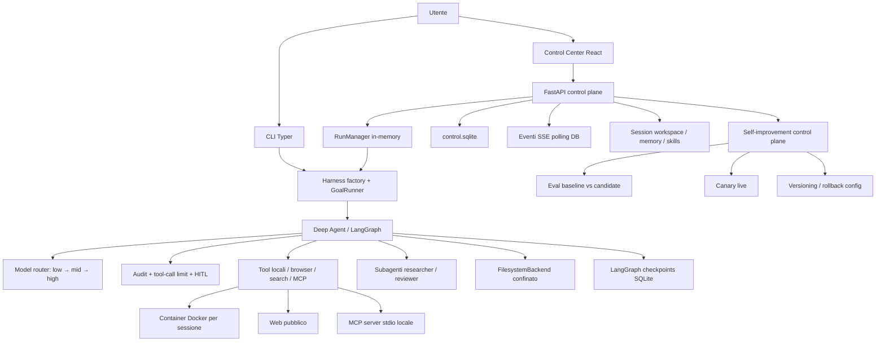
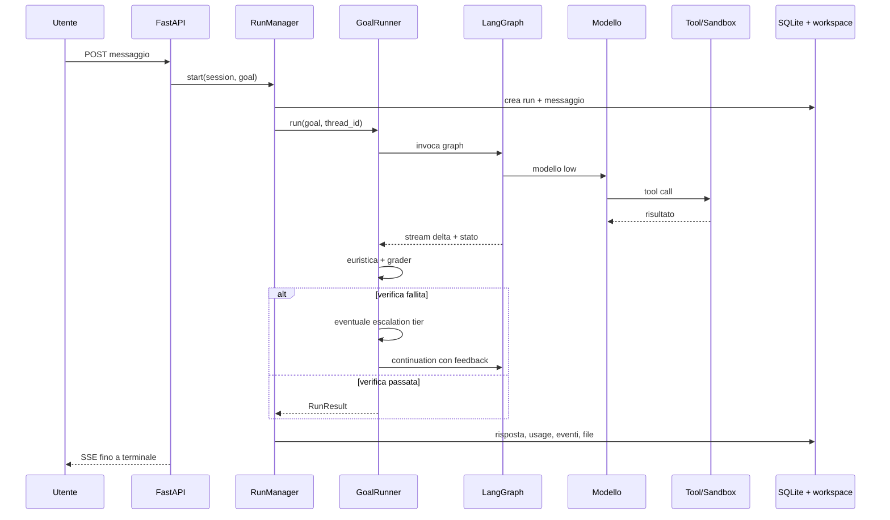
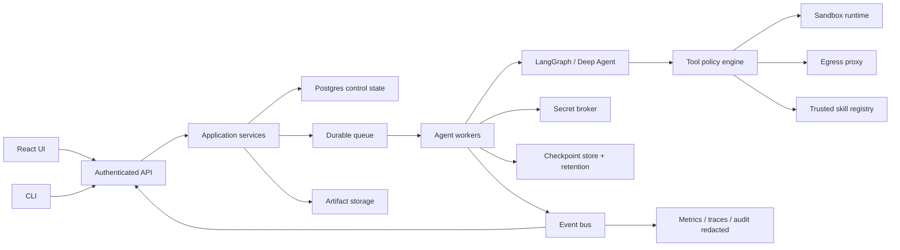

# Analisi dello stato attuale del LangChain Agent Harness

**Data analisi:** 11 luglio 2026  
**Commit osservato:** `3ccda6a` (`feat(router): escalate on measured failure instead of guessing from keywords`)  
**Branch:** `feat/tools-and-skills`  
**Ambito:** codice applicativo Python, Control Center React, persistenza, sandbox, sicurezza, test, eval, operabilità e documentazione.

## 1. Executive summary

Il repository implementa un agent harness didattico insolitamente completo. Non è un semplice wrapper attorno a un modello: include loop agente, tool, filesystem confinato, sandbox Docker, memoria, skill, subagenti, Human-in-the-Loop, streaming, persistenza, routing adattivo dei modelli, verifica a rubrica, trigger e un ciclo controllato di self-improvement.

Lo stato attuale è **solido come laboratorio locale avanzato e reference implementation**, ma **non ancora pronto come servizio production multi-user**. La separazione concettuale dei componenti è buona; la separazione fisica è meno matura, soprattutto nel control plane. `server.py` concentra API, orchestrazione run, streaming, trigger, miglioramenti, skill e file management in circa 1.700 righe. Persistenza e process lifecycle restano orientati a un singolo processo locale.

### Valutazione sintetica

| Area | Stato | Valutazione |
|---|---|---|
| Funzionalità harness | Molto ampia | Forte |
| Architettura core agente | Modulare e leggibile | Forte |
| Control plane API | Completo ma monolitico | Medio |
| Frontend | Funzionale, tipizzato, buildabile | Medio-forte |
| Test backend | 218 test raccolti, tutti verdi | Forte |
| Test frontend | Nessuna suite dedicata rilevata | Debole |
| Type safety Python | `mypy --strict` fallisce con 3 errori | Medio |
| Lint | Core verde; repository totale non verde | Medio |
| Sicurezza locale | Buone difese sandbox/SSRF/HITL | Forte per uso locale |
| Sicurezza production | Mancano auth, tenancy e secret broker | Debole |
| Operabilità | Tracing ricco, retention assente | Medio-debole |
| Self-improvement | Controllato e ben delimitato | Forte, ancora sperimentale |
| Documentazione | Ricca, con alcune discrepanze dal codice | Medio-forte |

### Principali punti di forza

1. Architettura del loop esplicita: modello, middleware, tool, checkpoint e runner hanno responsabilità riconoscibili.
2. Sicurezza sandbox concreta: root read-only, capability rimosse, `no-new-privileges`, limiti CPU/RAM/PID, utente non-root e rete revocabile.
3. Verifica multilivello: euristica deterministica, grader a rubrica, safety veto, continuation limitata ed eval deterministici.
4. Buona osservabilità applicativa: eventi SSE, trace tool, usage, modello selezionato, escalation, grader, file prodotti e attribution canary.
5. Self-improvement prudente: whitelist stretta, baseline/candidato, gate, canary, versioning e rollback.
6. Test backend estesi e offline: coprono server, runner, sandbox, skill, trigger, eval e promotion.

### Rischi principali

1. **Crescita incontrollata dello stato:** `state/` occupa circa 1,7 GB; `checkpoints.sqlite` da solo circa 1,4 GB. Nessuna retention o compaction applicativa rilevata.
2. **Segreti nel workspace:** il prompt invita a salvare token in `/workspace/.secrets/`. File nascosto alla UI non significa segreto isolato: agente, codice generato e tool sandbox possono leggerlo.
3. **Installazione skill globale e non approvata:** tool MCP può installare contenuto esterno nel catalogo condiviso; guardia URL consente loopback/RFC1918 e manca quarantena/firma/pinning obbligatorio.
4. **Protocollo `[GOAL_COMPLETE]` non realmente applicato:** documentazione e nomi test dichiarano un marker, ma `GoalRunner` decide il completamento senza verificarne la presenza.
5. **Control plane single-process:** task, future di approvazione e scheduler vivono in memoria; restart marca i run falliti e impedisce continuazione reale.
6. **Assenza auth e tenancy:** accettabile su `127.0.0.1`; per qualunque esposizione di rete diventa blocco assoluto.
7. **Copertura frontend non misurata:** lint e build passano, ma mancano test unitari, contract test ed E2E.

## 2. Metodo e prove raccolte

Analisi eseguita su:

- 24 moduli in `src/agent_harness`;
- API FastAPI e schema SQLite;
- client React/Vite;
- 20 casi eval versionati;
- 19 file di test backend;
- documentazione, Makefile, Dockerfile e configurazione;
- stato runtime locale, considerato solo in forma aggregata.

Comandi di verifica:

```text
uv run pytest -q
  218 test raccolti, tutti passati
  1 warning di deprecazione Starlette/httpx

uv run ruff check src tests evals scripts steps
  All checks passed

uv run mypy src/agent_harness
  3 errori in src/agent_harness/skills.py

cd client && npm run lint
  passato

cd client && npm run build
  passato; bundle JS 527,81 kB, gzip 151,14 kB
  warning Vite: chunk oltre 500 kB

uv run ruff check .
  fallito: 92 rilievi nei sorgenti vendorizzati di skills/skill-creator
```

Nota riproducibilità: l'esecuzione di `uv run` ha rilevato drift tra `pyproject.toml` e `uv.lock` per `aiosqlite`, aggiornando automaticamente il lock locale. La modifica generata dallo strumento è stata rimossa dopo la verifica. Il disallineamento resta quindi un finding del repository, non una modifica inclusa in questa analisi.

## 3. Scopo reale del sistema

Il sistema ha tre nature sovrapposte:

1. **Percorso didattico:** step incrementali `00`–`13`, notebook e guide.
2. **Applicazione locale utilizzabile:** CLI, API, chat, sessioni, file, trace e sandbox.
3. **Laboratorio di loop engineering:** eval, routing misurato, proposta config, canary e rollback.

Questa sovrapposizione spiega sia la ricchezza sia parte del debito. Codice dimostrativo, applicazione operativa, dati sperimentali e skill vendorizzate convivono nello stesso repository e sotto gli stessi comandi di qualità.

### Posizionamento consigliato

Nel breve termine: dichiarare esplicitamente il prodotto come **local-first, single-user, development-grade**. Evitare promesse di production readiness finché autenticazione, tenancy, retention, secret management e resilienza multi-process non sono implementati.

## 4. Architettura attuale

### 4.1 Vista componenti



### 4.2 Boundary principali

| Boundary | Input non attendibile | Difesa attuale |
|---|---|---|
| Modello → filesystem | path e contenuto generati | `FilesystemBackend`, permessi allow/deny |
| Modello → shell | comando arbitrario | container Docker, HITL, limiti risorse |
| Modello → rete | URL e query | browser SSRF guard, rete sandbox su approvazione |
| Browser → modello | HTML/testo esterno | banner “dato non attendibile”, script rimossi |
| Upload → workspace | file utente | allowlist estensioni, limite 25 MB, path basename |
| Workspace → browser | artefatti agente | preview solo raster/PDF, download attachment |
| Proposta → config live | output modello | whitelist, eval gate, canary, hash e rollback |
| Webhook → goal | payload esterno | token dedicato, payload delimitato come dato |

### 4.3 Scelte architetturali valide

- `factory.py` compone il graph senza incorporare logica di business del runner.
- `GoalRunner` incapsula continuation, escalation, approval e verifica.
- `control_store.py` separa persistenza UI/control plane dai checkpoint LangGraph.
- Ogni sessione API ha workspace isolato sotto `state/sessions/<id>`.
- Il container è persistente per sessione, ma il suo accesso rete è temporaneo per comando.
- Le config migliorate non modificano codice: sono override TOML versionabili.
- Baseline e candidato eval usano workspace e thread distinti.

### 4.4 Debito architetturale

- `server.py` agisce contemporaneamente da composition root, controller REST, application service, scheduler, stream broker e orchestratore.
- Stato run volatile (`tasks`, `approvals`, `interactions`) e stato durevole (SQLite) non formano una state machine transazionale unica.
- Due database SQLite più filesystem e JSON/TOML sidecar non hanno una strategia di consistenza o migrazione unificata.
- Componenti sincroni (`sqlite3`, `subprocess`) convivono con FastAPI async; alcuni passaggi usano threadpool, altri dipendono dal comportamento dei tool framework.
- Cache globali e singleton (`store`, `run_manager`, catalogo tool, sandbox manager) rendono test e multi-process più difficili.

## 5. Flussi runtime

### 5.1 Flusso chat/run



### 5.2 Routing dei modelli

Il routing non classifica linguisticamente il task. Ogni obiettivo parte dal gradino basso; il runner sale quando:

- manca una verifica sandbox richiesta dall'euristica; oppure
- il grader produce score sotto `HARNESS_ESCALATION_THRESHOLD`.

Fra soglia escalation e soglia rubric, il runner riprova sullo stesso tier. Override sessione e marker nel messaggio hanno precedenza sull'escalation.

Punto positivo: costo e capacità salgono su un segnale osservato. Punto debole: il segnale dipende da un grader LLM e da un'euristica lessicale italiana sui verbi mutativi.

### 5.3 Completion e continuation

Il runner usa massimo `HARNESS_MAX_CONTINUATIONS`, default 3. Il completamento effettivo è:

- testo non vuoto;
- verifica ambiente riuscita se `requires_environment_verification(goal)` riconosce uno dei verbi configurati;
- grader assente o superato.

**Discrepanza:** `[GOAL_COMPLETE]` è richiesto nel prompt, rimosso dalla risposta UI e citato nella documentazione, ma il runner non controlla la sua presenza. Un testo senza marker viene accettato se euristica e grader passano. Il test `test_runner_stops_on_completion_marker` passa per assenza di grader e goal non mutativo, non perché il marker sia interpretato.

Decisione necessaria:

- eliminare il marker da prompt, CLI e documentazione, trattandolo come vestigiale; oppure
- renderlo un requisito deterministico nel runner e aggiungere test negativi senza marker.

La prima opzione è consigliata: grader + check deterministici sono segnali migliori di una stringa auto-dichiarata dal modello.

### 5.4 Human-in-the-Loop

Due interrupt distinti:

- approvazione `docker_exec`, con classificazione statica del comando;
- `request_user_action` per OAuth, 2FA, upload o azioni esterne.

Aspetti riusciti:

- network access richiede sempre approvazione, anche in auto-approve;
- più tool sensibili paralleli ricevono un numero coerente di decisioni;
- timeout deterministici: 10 minuti approvazione, 30 minuti user action;
- comando mostrato e classificato senza usare un LLM.

Limite: future e interrupt pending vivono nel processo. Restart = run fallito; nessuna ripresa cross-process.

## 6. Funzionalità disponibili

### 6.1 Interfacce

| Funzione | CLI | API/UI | Stato |
|---|---:|---:|---|
| Chat multi-turno | Sì | Sì | Completa |
| Run one-shot | Sì | Via chat/trigger | Completa |
| Streaming risposta | Limitato | SSE | Completa |
| Approvazione comando | Terminale | Dialog UI | Completa |
| User action guidata | Callback | Dialog UI | Completa |
| Gestione sessioni | No | Sì | Completa |
| Upload/download file | No | Sì | Completa |
| Trace e timeline | Output eventi | Sì | Completa |
| Gestione skill | MCP | Sì | Completa |
| Trigger cron/webhook | No | Sì | Presente, disabilitato di default |
| Self-improvement | Proposta | Ciclo completo | Presente |
| Eval | Sì | Per proposta | Presente, costoso |
| Rollback config | No | Sì | Completo |

### 6.2 Tool agente

Tool built-in:

- `current_utc_time`;
- `docker_exec`;
- `request_user_action`;
- `web_search`, opzionale;
- `browser_read`, opzionale.

Tool MCP locali:

- conteggio testo e glossario;
- elenco, lettura, creazione, scrittura e installazione skill.

Subagenti:

- `researcher`, low-tier, con search/browser/time;
- `reviewer`, mid-tier, filesystem read-only e senza tool mutativi.

### 6.3 Filesystem, memoria e skill

- Workspace globale per CLI e workspace per-sessione per API.
- Memoria template in `memories/AGENTS.md`, copiata nella sessione.
- Memoria sessione modificabile e promuovibile al template.
- Skill globali copiate nella root sessione a inizio run.
- Progressive disclosure via Deep Agents.
- Deliverable convenzionali in `output/`; cache e file nascosti esclusi dalla UI.

Rischio semantico: “nascosto alla UI” viene usato anche per `.secrets`, ma non equivale a isolamento di sicurezza.

### 6.4 Trigger

- Cron a 5 campi, timezone IANA e preview prossime esecuzioni.
- Webhook con token random e confronto constant-time.
- Anti-double-fire in-memory per minuto.
- Payload webhook delimitato come dato non attendibile.

Limiti:

- scheduler disabilitato per default e non documentato in `.env.example`;
- anti-double-fire non è distribuito né durevole;
- in multi-worker ogni processo potrebbe eseguire lo stesso trigger;
- nessun retry/backoff/dead-letter queue;
- semantica DOM/DOW cron implementata come AND, mentre molti cron tradizionali usano OR quando entrambi sono specificati: va documentata o corretta.

### 6.5 Self-improvement

Pipeline implementata:

```text
run/eventi → report debolezze → proposta strutturata → whitelist
→ eval paired baseline/candidato → gate → canary → promotion/rollback
```

Vincoli forti:

- solo `system_prompt_addendum` e `harness_max_tool_calls` sono modificabili;
- rubric e soglie congelate;
- hash lega baseline, candidato e proposta;
- zero regressioni su check e completion;
- limiti token e latenza;
- canary richiede almeno 5 run per arm.

Limiti metodologici:

- 20 casi eval sono un buon nucleo, ma piccoli per inferenze robuste su prompt general-purpose;
- eval paired è sequenziale: lento e costoso;
- threshold e gate sono fissi nel codice, non versionati come policy separata;
- canary con 5 run per arm ha potenza statistica bassa;
- attribution misura sessioni reali non randomizzate per task: possibile selection bias;
- proposta modifica solo due leve, quindi “self-improvement” è correttamente prudente ma limitato.

## 7. Backend: analisi modulo per modulo

| Modulo | Responsabilità | Stato | Miglioramento principale |
|---|---|---|---|
| `config.py` | Settings e path | Chiaro | Validare compatibilità modelli/effort e separare config display da enforcement |
| `factory.py` | Composizione graph | Buono | Iniettare provider, tool registry e checkpointer factory |
| `runner.py` | Loop, approval, grader, escalation | Centrale e leggibile | Completion contract tipizzato; euristiche multilingua/deterministiche |
| `middleware.py` | Routing modelli | Buono | Persistenza decisione per turn e metriche di costo reali |
| `tools.py` | Tool built-in | Semplice | Timeout/retry/circuit breaker coerenti |
| `sandbox.py` | Lifecycle container | Robusto | Coda job, health, quota disco e cleanup workspace |
| `browser.py` | Fetch sicuro | Buono | Mitigare DNS rebinding con connessione all'IP validato/proxy egress |
| `skills.py` | CRUD/install skill | Ricco | Fix mypy, blocco reti private, trust policy, quarantena |
| `control_store.py` | DB control plane e file sessione | Funzionale | Repository async, migrazioni versionate, retention |
| `server.py` | Tutto il control plane | Troppo ampio | Spezzare router/service/repository/worker |
| `audit.py` | Audit JSONL + trace dettagliata | Utile | Redazione strutturata; evitare output sensibili negli eventi DB |
| `verification.py` | Rubric e safety veto | Buono | Versionare rubric, calibrare periodicamente, separare judge provider |
| `evaluation.py` | Dataset, checks, paired eval | Buono | Parallelismo controllato, resume, repeated runs e CI offline |
| `improve.py` | Report e proposta | Prudente | Schema policy versionato, id collision-safe |
| `canary.py` | Metriche live | Semplice | Intervalli confidenza, sample size dinamica, task stratification |
| `promotion.py` | Versioni/rollback | Buono | Scritture atomiche e audit actor/reason |
| `triggers.py` | Cron scheduler | Adeguato locale | Lease DB, idempotency key, retry queue |
| `usage.py` | Usage e categorie contesto | Utile | Distinguere costo cumulativo da dimensione ultimo contesto |

## 8. Control Center React

### 8.1 Stato attuale

Stack:

- React 19;
- TypeScript 5.7;
- Vite 6;
- Tailwind 4;
- `react-markdown` + GFM;
- fetch/SSE nativi.

La UI copre chat, sessioni, model override, file, memoria, context inspection, sandbox, tool/skill activity, trace, trigger, miglioramenti, canary e settings.

Aspetti positivi:

- tipi API centralizzati;
- hook `useHarnessSession` concentra lifecycle della sessione;
- componenti separati per aree funzionali;
- parsing SSE con allowlist eventi;
- rendering HTML/SVG agente non inline;
- build e lint verdi.

### 8.2 Debito frontend

1. Nessun framework test rilevato (`vitest`, Testing Library, Playwright/Cypress app-level).
2. `useHarnessSession.ts` (~468 righe), `api.ts` (~439), `runTrace.ts` (~463), `SkillsView.tsx` (~654) e `ImproveView.tsx` (~588) sono hotspot.
3. Bundle JS supera soglia Vite: 527,81 kB minificato. Route/view pesanti non lazy-loaded.
4. Stato remoto gestito manualmente: polling, invalidazione e race condition richiedono molta logica custom.
5. Nessuna generazione tipi da OpenAPI, quindi schema Python e TypeScript possono divergere.
6. Nessun error boundary globale o telemetria frontend evidente.
7. Accessibilità e keyboard flow non risultano verificati automaticamente.

### 8.3 Miglioramenti frontend

- Lazy-load di `TraceView`, `SkillsView`, `ImproveView` e `TriggersView`.
- Estrarre hook per run stream, session CRUD, file e approval.
- Generare client/type da schema OpenAPI in build.
- Aggiungere Vitest + Testing Library per reducer/parser/hook.
- Aggiungere Playwright E2E su backend fake o fixture locale.
- Budget bundle in CI, per esempio 450 kB entry chunk.
- Audit accessibilità con axe nei test E2E.

## 9. Persistenza e modello dati

### 9.1 Storage attuale

| Storage | Contenuto |
|---|---|
| `state/control.sqlite` | sessioni, messaggi, run, eventi, trigger |
| `state/checkpoints.sqlite` | checkpoint LangGraph |
| `state/sessions/<id>` | workspace, memoria, skill copiate, context snapshot |
| `state/evaluations` | workspace e risultati eval |
| `state/improvements` | proposta Markdown + sidecar JSON |
| `state/config_versions` | snapshot config |
| `state/harness_overrides.toml` | config attiva |
| `state/canary.json` | canary attiva |
| `state/audit.jsonl` | audit minimale tool |

### 9.2 Dati runtime osservati

Al momento dell'analisi:

- 31 sessioni;
- 125 messaggi;
- 68 run: 57 `completed`, 8 `failed`, 3 `cancelled`;
- 54/57 eventi `run.completed` con `completed=true`, 3 con `completed=false`;
- 60 verifiche grader, 42 passate, score medio 0,766;
- 69.964 eventi totali;
- 2 trigger abilitati, uno cron e uno webhook;
- circa 1,7 GB in `state/`;
- circa 1,4 GB in `checkpoints.sqlite`;
- circa 349 MB in workspace sessione;
- circa 17 MB in evaluation directory;
- circa 19 MB in `control.sqlite`.

I delta streaming dominano gli eventi: circa 32.903 `assistant.delta` e 32.903 `usage.live`. Ogni frammento genera inoltre una scrittura usage live. Questo spiega parte della crescita e della write amplification del control DB.

### 9.3 Problemi

1. Nessuna retention per checkpoint, eventi, run, sessioni o evaluation.
2. Nessuna quota per workspace/sessione; installazioni in `.pylib` hanno prodotto directory oltre 100 MB.
3. Schema DB evoluto con `ALTER TABLE` ad avvio, senza migration framework o versione schema.
4. Eventi delta e usage live persistiti granularmente; utili live, costosi storicamente.
5. Stato distribuito su SQLite, JSON, TOML e filesystem; rollback parziale può lasciare combinazioni incoerenti.
6. `ControlStore.close()` esiste ma non viene chiamato nel lifespan server.
7. Backup/restore non documentati.

### 9.4 Piano storage consigliato

Breve termine:

- retention configurabile per sessioni, eventi, checkpoint ed eval;
- compattare `assistant.delta` in blocchi da 100–250 ms o 1–4 KB;
- non persistere ogni `usage.live`, oppure mantenerne solo uno ogni secondo;
- quota per workspace e cache dipendenze;
- comando `harness maintenance` con dry-run, prune, VACUUM e report;
- chiusura esplicita store nel lifespan.

Medio termine:

- migrazioni Alembic o schema migrator equivalente;
- repository interface e unit of work;
- Postgres per control plane multi-process;
- object storage per artefatti grandi;
- backend checkpoint con retention e delete per thread.

## 10. Sicurezza

### 10.1 Difese ben implementate

- API bind su `127.0.0.1`.
- CORS limitato a due origini dev.
- Mutazioni con `Origin` esterna rifiutate.
- Webhook token constant-time.
- Upload limitato per tipo e dimensione.
- Path confinement e rifiuto symlink su download/preview.
- HTML/SVG mai serviti inline.
- Browser tool limita schema, content type, redirect e dimensione.
- Container non-root, root read-only, capability drop, no-new-privileges e resource limits.
- Rete sandbox interna di default; egress temporaneo richiede conferma.
- Nessun Docker socket o secret host montato nel container.
- Estrazione archive protegge da path traversal, symlink, hardlink e zip bomb tramite limiti.
- Git clone usa argomenti list-form, protocolli limitati e niente prompt credenziali.
- Rubric ha safety veto deterministico.

### 10.2 Gap critici prima di exposure di rete

#### A. Autenticazione e autorizzazione assenti

Ogni client che raggiunge l'API può leggere sessioni, file, memoria, trace, installare skill, lanciare run, approvare comandi e modificare config. Bind loopback riduce il rischio, ma non è un controllo di identità.

Serve:

- auth utente;
- ownership per sessione/run/file/trigger;
- ruoli separati per run, approvazione, skill install e promotion;
- CSRF token o auth bearer non ambientale;
- audit actor/tenant.

#### B. Segreti model-visible

`SYSTEM_PROMPT` ordina di salvare token e segreti in `/workspace/.secrets/`. Questa directory:

- persiste tra run;
- è leggibile dal modello via filesystem;
- è montata in scrittura nel container;
- può essere letta da codice generato;
- può essere esfiltrata durante un comando con rete approvato.

Rimedio: secret broker host-side. Il modello riceve handle o capability, non token. Iniezione solo nel processo autorizzato, con scope e TTL minimi; redazione automatica in tool output, trace ed errori.

#### C. Eventi trace contengono argomenti e output

`audit.jsonl` è minimale, ma eventi in `control.sqlite` includono fino a 1.500 caratteri di argomenti e 4.000 di output tool. Possono contenere token, PII o dati file.

Rimedio:

- redactor strutturato prima della persistenza;
- denylist chiavi (`token`, `secret`, `authorization`, `cookie`, ecc.);
- classificazione dati e retention breve;
- modalità trace dettagliata opt-in.

#### D. Supply chain skill

Skill installate diventano globali e disponibili a sessioni future. L'installazione da MCP non ha HITL dedicato. `_guard_external_host` permette loopback e reti private, scelta giustificata come harness locale ma pericolosa se invocabile dal modello.

Rimedio:

- bloccare IP non globali come nel browser tool;
- richiedere approval per install/update/revoke skill;
- installare in quarantena;
- mostrare diff e manifest prima dell'attivazione;
- pin commit SHA o checksum archive;
- trust store e provenance;
- scope skill per utente/progetto, non globale.

#### E. Prompt injection resta difesa probabilistica

Banner “dato non attendibile” e system prompt sono buone istruzioni, ma non confini deterministici. Tool con side effect persistenti devono avere policy runtime indipendenti dal modello.

### 10.3 Gap secondari

- DNS rebinding: URL validato prima, poi `httpx` risolve di nuovo.
- Nessun proxy egress con allowlist/domain policy.
- Nessuna scansione malware per upload o skill.
- Nessun dependency/SBOM scanning automatizzato.
- Nessun rate limiting per API, webhook, eval o upload.
- Nessun limite totale eventi/sessione.
- CSP riguarda preview file, non è stata rilevata una policy globale frontend.
- Origin check accetta richieste mutative senza header `Origin`, appropriato per CLI locale ma non sufficiente come CSRF/auth boundary.

## 11. Qualità, test e mantenibilità

### 11.1 Cosa funziona bene

- 218 test raccolti e verdi.
- Test offline: nessun costo modello.
- Buona copertura concettuale delle parti rischiose.
- Ruff core completamente verde.
- TypeScript build e ESLint verdi.
- Test sandbox verificano flags, lifecycle e rete.
- Test server coprono numerose route e state transition.

### 11.2 Gap qualità

1. Nessun report coverage e nessuna soglia minima.
2. Nessuna CI rilevata in `.github/workflows`.
3. Nessun test frontend.
4. `mypy --strict` non è verde:
   - ignore errato/non sufficiente su redirect handler;
   - funzione senza annotazioni;
   - ritorno `Any` da funzione dichiarata `bytes`.
5. `make lint` usa `ruff check .` e fallisce sui file vendorizzati `skills/skill-creator` con 92 rilievi. Quindi il comando documentato non è attualmente verde.
6. `uv.lock` non riflette `aiosqlite` dichiarato in `pyproject.toml`.
7. Warning deprecazione Starlette/httpx nei test.
8. Nessun test di recovery da crash/restart durante approval o action.
9. Nessun test di carico SSE/concorrenza SQLite.
10. Nessun chaos test Docker/network disconnect.

### 11.3 Correzioni immediate

- Rendere verdi `mypy` e `make lint`.
- Escludere skill vendorizzate da Ruff, oppure trattarle come codice mantenuto e correggerle. Scelta esplicita.
- Rigenerare e committare `uv.lock` coerente.
- Aggiungere CI: format check, Ruff, mypy, pytest, client lint/build/test, notebook validation.
- Aggiungere coverage backend e frontend.
- Pin coerente strumenti tra dev e Docker sandbox.

## 12. Documentazione: accuratezza e drift

Documentazione generale è buona e spiega motivazioni, non solo API. Drift rilevati:

1. README descrive trigger come funzionalità disponibile, ma default runtime è `HARNESS_ENABLE_TRIGGERS=false` e `.env.example` non espone setting/tick.
2. Documentazione parla di marker `[GOAL_COMPLETE]` come protocollo; codice non lo verifica.
3. `HARNESS_CONTEXT_WINDOW` è mostrato in UI, ma non viene passato al modello né usato come limite/trigger di compaction nel codice applicativo. È attualmente metadato dichiarativo.
4. `SECURITY.md` dice che segreti non sono montati nel container, ma prompt invita a salvare nuovi token nel workspace, che invece è montato.
5. README presenta `make lint` come comando normale, ma oggi fallisce sui sorgenti skill vendorizzati.
6. Lock dependency drift riduce riproducibilità dell'avvio documentato.

## 13. Priorità di miglioramento

### P0 — prima di qualunque deployment condiviso

| Intervento | Perché | Criterio di completamento |
|---|---|---|
| Auth + tenancy | API concede controllo completo | ogni risorsa ha owner; test cross-tenant negativi |
| Secret broker | token oggi model-visible | nessun secret persistito nel workspace/trace |
| Retention checkpoint/eventi | 1,7 GB già in uso locale | policy automatica, dry-run, metriche e restore testato |
| Trust policy skill | side effect persistente globale | approval, checksum/pin, quarantena, provenance |
| Worker durable | restart perde run/approval | run riprendibile o fallimento transazionale esplicito |

### P1 — robustezza e qualità

| Intervento | Impatto |
|---|---|
| Spezzare `server.py` | riduce coupling e rischio regressioni |
| Migrazioni DB versionate | upgrade affidabili |
| CI completa | impedisce drift già osservato |
| Frontend test + code splitting | riduce regressioni e bundle |
| Completion contract coerente | elimina mismatch marker/grader |
| Scheduler con lease DB | evita doppio fire multi-worker |
| Redazione trace | limita esposizione dati |

### P2 — evoluzione del prodotto

| Intervento | Impatto |
|---|---|
| Provider abstraction | modelli/vendor sostituibili |
| Queue + worker pool | scala run concorrenti |
| Postgres/object storage | deployment multi-instance |
| Eval repeated/stratified | decisioni promotion più affidabili |
| Cost accounting reale | routing ottimizzato su spesa, non solo tier |
| Policy engine tool | permessi deterministici per tool/argomento |

## 14. Roadmap proposta

### Fase 0 — Stabilizzazione, 1–2 settimane

1. Correggere 3 errori mypy.
2. Decidere policy lint per codice vendorizzato.
3. Aggiornare `uv.lock`.
4. Aggiungere CI.
5. Correggere documentazione marker, trigger, context window e segreti.
6. Aggiungere comando diagnostico storage.
7. Ridurre persistenza eventi live.

Deliverable:

- pipeline verde;
- documentazione coerente;
- crescita storage misurata e limitata;
- nessuna modifica di comportamento agente non coperta da test.

### Fase 1 — Modularizzazione control plane, 2–4 settimane

Struttura target:

```text
agent_harness/
  api/
    sessions.py
    runs.py
    files.py
    skills.py
    triggers.py
    improvements.py
  application/
    run_service.py
    approval_service.py
    skill_service.py
    improvement_service.py
  domain/
    run_state.py
    policies.py
  infrastructure/
    control_repository.py
    checkpoint_repository.py
    sandbox_runtime.py
    event_bus.py
```

Mantenere FastAPI e SQLite inizialmente; cambiare confini prima di cambiare tecnologia.

### Fase 2 — Sicurezza applicativa, 3–6 settimane

1. Identità e RBAC.
2. Secret broker con capability temporanee.
3. Skill quarantine/provenance.
4. Trace redaction.
5. Rate limit e quota.
6. Egress proxy/policy.
7. Security test automatizzati.

### Fase 3 — Durabilità e scala, 4–8 settimane

1. Queue durable per run e trigger.
2. Lease/idempotency key.
3. Postgres control plane.
4. Artifact storage esterno.
5. Checkpoint pruning.
6. Multi-worker e restart recovery test.

### Fase 4 — Miglioramento misurabile continuo

1. Eval per categoria e difficoltà.
2. Repeat runs e intervalli confidenza.
3. Holdout non visibile al proposer.
4. Budget costo assoluto.
5. Canary stratificata per task.
6. Dashboard drift e regressioni.

## 15. Architettura target suggerita



Principio guida: separare **decisione del modello** da **autorizzazione del runtime**. Il modello può proporre tool e argomenti; policy engine, identity, secret broker e sandbox decidono cosa è permesso.

## 16. KPI e SLO consigliati

### Affidabilità

- run tecnicamente falliti < 2%;
- run bloccati dopo restart = 0;
- doppio fire trigger = 0;
- recovery test trimestrale passato.

### Qualità agente

- eval check pass rate per categoria;
- completion rate separato da status tecnico;
- safety veto rate;
- escalation rate low→mid e mid→high;
- retry tool identici per run;
- grader calibration separation.

### Costo e performance

- costo stimato e fatturato per run;
- p50/p95 time-to-first-token;
- p50/p95 run duration;
- token cumulativi per run e context size finale separati;
- tool latency/error rate;
- bundle frontend e tempo interattività.

### Storage

- byte per run/sessione;
- crescita giornaliera checkpoint/eventi;
- workspace oltre quota;
- retention lag;
- tempo VACUUM/backup/restore.

### Sicurezza

- secret redaction failures = 0;
- tool/skill action negate dal policy engine;
- skill senza provenance attiva = 0;
- accessi cross-tenant riusciti = 0;
- egress non autorizzato = 0.

## 17. Quick wins ordinati per rapporto valore/costo

1. Correggere `skills.py` e rendere `mypy --strict` verde.
2. Aggiornare `uv.lock` con `aiosqlite`.
3. Escludere formalmente `skills/skill-creator` da Ruff o correggerla.
4. Aggiungere workflow CI unico.
5. Eliminare o applicare davvero `[GOAL_COMPLETE]`.
6. Documentare `HARNESS_ENABLE_TRIGGERS` e relativo tick in `.env.example`.
7. Rinominare `harness_context_window` come valore informativo, oppure collegarlo realmente alla compaction/config modello.
8. Aggregare delta SSE e usage live prima della persistenza.
9. Implementare `harness maintenance --dry-run` e retention iniziale.
10. Rimuovere indicazione di salvare segreti nel workspace.
11. Richiedere approval per `skill_install` e bloccare reti private.
12. Lazy-load delle viste UI pesanti.
13. Aggiungere 10–15 test frontend sui parser/event lifecycle più critici.
14. Chiamare `store.close()` nel lifespan.
15. Aggiungere endpoint/readiness check separato da status funzionale.

## 18. Decisioni architetturali da formalizzare

Creare ADR per:

1. target locale single-user vs servizio condiviso;
2. significato ufficiale di completion;
3. semantica usage: costo cumulativo vs ultimo contesto;
4. trust model delle skill;
5. storage e retention;
6. scheduler single-process vs distributed;
7. provider/model abstraction;
8. secret lifecycle;
9. ownership dei file e cancellazioni;
10. criteri statistici del canary gate.

## 19. Conclusione

Il sistema dimostra comprensione profonda dell'anatomia di un agent harness. Parti più difficili — sandbox, approval, trace, verification ed eval-gated improvement — non sono mock concettuali: esistono nel codice e sono ampiamente testate.

Prossimo salto non richiede aggiungere altre feature agente. Richiede consolidare piattaforma attorno al loop già valido:

- stato con lifecycle;
- control plane modulare;
- identità e policy;
- segreti fuori dal workspace;
- skill con trust chain;
- CI e test frontend;
- metriche con semantica precisa.

Verdetto finale: **ottima reference implementation locale, buona base per prodotto, non ancora piattaforma production**. Priorità immediata: storage retention, secret isolation, coerenza completion e pipeline qualità completamente verde.
