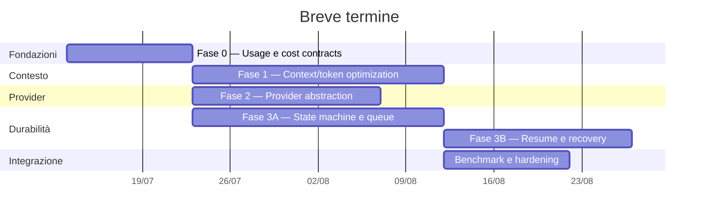

# Piano evolutivo a fasi

**Data:** 11 luglio 2026  
**Orizzonte:** 4–6 mesi  
**Priorità breve termine:** gestione contesto, consumo token e cost accounting reale, astrazione provider, work durable.  
**Documento di partenza:** `docs/ANALISI_STATO_ATTUALE.md`.

## 1. Obiettivo

Portare harness da applicazione locale avanzata a piattaforma affidabile, misurabile ed estendibile, senza perdere semplicità didattica.

Ordine scelto:

```text
misurazione affidabile
  → context/token optimization
  → provider abstraction
  → durable work
  → sicurezza e modularità
  → scala multi-process/multi-user
  → qualità prodotto e self-improvement avanzato
```

Prime quattro capacità devono arrivare nel breve termine. Non sono quattro progetti indipendenti:

- context management richiede usage normalizzato;
- cost accounting richiede provider/model registry;
- provider abstraction deve esporre capability, usage e pricing;
- durable work deve persistere decisioni di routing, budget contesto, costi e interrupt.

## 2. Principi di esecuzione

1. Prima osservabilità, poi ottimizzazione.
2. Una sola semantica per token, contesto e costo in CLI, API, eval e canary.
3. Contratti interni provider-neutral; adapter vendor-specific ai bordi.
4. Ogni side effect usa idempotency key.
5. Stato run durevole; task asyncio solo executor, mai source of truth.
6. Migrazioni incrementali; nessuna riscrittura big-bang.
7. Ogni fase ha feature flag, test e rollback.
8. Separare costo economico, dimensione contesto e token cumulativi: misure diverse.

## 3. Target dei primi 90 giorni

Entro 90 giorni:

- budget contesto applicato realmente, non solo mostrato in UI;
- compaction osservabile, prevedibile e testata;
- riduzione token cumulativi mediani almeno 25% su eval set, senza regressione qualità;
- costo reale per chiamata, run, sessione, modello e provider;
- supporto minimo a due provider o a un provider reale più adapter fake conforme;
- supporto locale esplicito per Ollama e MLX su Apple Silicon, almeno in modalità sperimentale;
- run recuperabili dopo restart;
- approval e user action persistenti e riprendibili;
- trigger idempotenti e senza doppio fire;
- pipeline CI completamente verde.

## 4. Fase 0 — Baseline e contratti di misura

**Durata:** 1–2 settimane  
**Priorità:** immediata  
**Scopo:** eliminare ambiguità prima di ottimizzare.

### 4.1 Problema

Oggi `compute_usage()` usa:

- ultimo `input_tokens` come dimensione contesto finale;
- somma `output_tokens` come output cumulativo.

Evaluation usa invece somma input/output di tutti i messaggi. UI, eval, canary e report possono quindi parlare di “token” con semantiche diverse. Prezzi configurati servono al tooltip, non producono ledger economico.

### 4.2 Lavoro

Definire modello canonico:

```python
class ModelCallUsage:
    provider: str
    model: str
    execution_kind: Literal["cloud", "local"]
    input_tokens: int
    cached_input_tokens: int
    output_tokens: int
    reasoning_tokens: int
    total_tokens: int
    input_cost: Decimal
    output_cost: Decimal
    reasoning_cost: Decimal
    total_cost: Decimal
    effective_local_cost: Decimal | None
    pricing_version: str
    estimated: bool
```

Creare eventi:

- `model.call.started`;
- `model.call.completed`;
- `model.call.failed`;
- `context.compaction.started/completed`;
- `budget.warning/exceeded`.

Separare metriche:

| Metrica | Significato |
|---|---|
| `context_input_tokens` | input dell’ultima chiamata |
| `cumulative_input_tokens` | somma input di tutte le chiamate |
| `cumulative_output_tokens` | somma output |
| `reasoning_tokens` | reasoning fatturato, se esposto |
| `cached_input_tokens` | input cache, se esposto |
| `billable_tokens` | token secondo regole provider |
| `actual_cost` | costo calcolato da usage provider |
| `estimated_cost` | fallback quando usage parziale |
| `effective_local_cost` | stima opzionale energia + ammortamento hardware per inferenza locale |

### 4.3 Storage

Nuove tabelle:

```text
model_calls
  id, run_id, iteration, provider, model, tier
  started_at, completed_at, status
  input_tokens, cached_input_tokens, output_tokens, reasoning_tokens
  input_cost, output_cost, reasoning_cost, total_cost
  effective_local_cost, execution_kind
  pricing_version, usage_source, raw_usage_json

pricing_catalog
  provider, model, valid_from, valid_to
  input_price, cached_input_price, output_price, reasoning_price
  currency, source, version
```

Usare `Decimal`, mai `float`, per costo.

### 4.4 Deliverable

- ADR “Semantica token e costo”.
- Schema usage canonico.
- Pricing registry versionato.
- Migrazione DB.
- Dashboard base costo/token per run.
- Conversione eval, canary e report alla stessa semantica.

### 4.5 Acceptance criteria

- stessa somma token/costo in API, UI, eval e report;
- riconciliazione con usage provider entro tolleranza 1%;
- ogni model call ha provider, model, usage source e pricing version;
- nessun uso di prezzi correnti per ricalcolare retroattivamente run storici;
- test fixture per usage completo, parziale, cached e assente.
- provider locale non viene presentato come “gratis”: costo API può essere zero, ma latenza,
  energia, memoria e occupazione hardware restano metriche separate.

## 5. Fase 1 — Context management e token optimization

**Durata:** 2–4 settimane  
**Priorità:** breve termine, massima  
**Dipendenza:** Fase 0.

### 5.1 Obiettivo

Ridurre token cumulativi senza perdere informazione necessaria, rendendo budget e compaction espliciti.

### 5.2 Context budget manager

Creare componente provider-neutral:

```python
class ContextBudget:
    max_tokens: int
    reserved_output_tokens: int
    warning_ratio: float
    compaction_ratio: float

class ContextBudgetManager:
    def inspect(messages, model_capabilities) -> ContextSnapshot: ...
    def decide(snapshot, budget) -> ContextAction: ...
```

Azioni possibili:

- `keep`;
- `offload_tool_output`;
- `summarize_history`;
- `drop_reconstructible_events`;
- `start_fresh_continuation`;
- `reject_over_budget`.

### 5.3 Politica contesto

Ordine di riduzione:

1. eliminare duplicati e delta intermedi;
2. sostituire tool output lungo con riferimento a file + checksum + estratto;
3. mantenere solo ultima osservazione per tool idempotente ripetuto;
4. comprimere turni chiusi in summary strutturato;
5. preservare sempre obiettivo, vincoli, decisioni, piano, errori aperti e prove;
6. aprire continuation fresca quando compaction non basta.

Summary strutturato:

```yaml
goal: ...
constraints: [...]
decisions: [...]
completed: [...]
open_items: [...]
artifacts:
  - path: ...
    checksum: ...
verification: [...]
failures: [...]
```

### 5.4 Ottimizzazioni immediate

- non persistere `usage.live` per ogni delta;
- aggregare `assistant.delta` in blocchi temporali/dimensionali;
- limitare output tool per categoria, non con unico limite globale;
- offload automatico oltre soglia, con preview corta;
- evitare reiniezione integrale dell’obiettivo se già presente nel summary durevole;
- deduplicare system prompt, memoria e skill caricate;
- leggere solo sezioni skill necessarie;
- cache di risultati read-only con chiave tool + args + versione file;
- interrompere retry identici senza nuovo segnale;
- rendere `HARNESS_CONTEXT_WINDOW` un limite applicato davvero.

### 5.5 Budget economico

Aggiungere per run/sessione:

- max token cumulativi;
- max costo;
- max chiamate modello;
- max chiamate grader/subagente;
- warning a 70%, compaction a 80%, hard stop/escalation controllata a 95–100%.

Routing deve considerare costo residuo:

```text
qualità insufficiente + budget disponibile → retry/escalation
qualità insufficiente + budget quasi esaurito → risposta incompleta esplicita
task già verificato → stop, nessun grader/retry ulteriore
```

### 5.6 Benchmark

Costruire corpus con:

- conversazioni lunghe;
- tool output grandi;
- molte letture file;
- più continuation;
- skill e memoria;
- subagenti;
- task mutativi e non mutativi.

Misurare baseline/candidato:

- check pass rate;
- cumulative input/output tokens;
- costo;
- latenza;
- compaction count;
- informazioni critiche perse;
- numero retry/tool duplicati.

### 5.7 Acceptance criteria

- almeno -25% token cumulativi mediani sui casi lunghi;
- nessuna regressione check deterministico;
- costo medio almeno -20%;
- p95 contesto sotto 85% finestra modello;
- summary ricostruibile e ispezionabile in UI;
- budget hard rispettato nel 100% test;
- nessun tool output oltre soglia reiniettato integralmente.

## 6. Fase 2 — Provider abstraction

**Durata:** 2–3 settimane  
**Priorità:** breve termine  
**Dipendenze:** Fase 0; sviluppo parziale parallelo a Fase 1.

### 6.1 Obiettivo

Rimuovere dipendenza diretta da `ChatOpenAI` nella factory e rendere esplicite differenze provider.

### 6.2 Contratti

```python
class ModelCapabilities:
    context_window: int
    max_output_tokens: int
    supports_tools: bool
    supports_parallel_tools: bool
    supports_structured_output: bool
    supports_reasoning: bool
    supports_prompt_caching: bool
    supports_encrypted_reasoning: bool
    supports_usage_reporting: bool
    supports_model_listing: bool

class ModelDescriptor:
    provider: str
    model: str
    capabilities: ModelCapabilities
    pricing_key: str

class ModelProvider(Protocol):
    def build_chat_model(self, descriptor, options) -> BaseChatModel: ...
    def normalize_usage(self, response) -> ModelCallUsage: ...
    def classify_error(self, exc) -> ProviderError: ...
```

### 6.3 Componenti

- `ProviderRegistry`;
- `OpenAIProviderAdapter`;
- `OllamaProviderAdapter`;
- `MLXProviderAdapter` per `mlx_lm.server` o endpoint MLX compatibile configurato;
- secondo adapter reale oppure `ConformanceProviderAdapter` fake;
- `PricingCatalog`;
- `CapabilityResolver`;
- `ProviderError` canonico;
- policy retry per errore normalizzato;
- model alias config, separato da nome vendor.

Esempio config:

```toml
[models.low]
provider = "openai"
model = "..."
reasoning_effort = "low"
pricing_key = "openai/..."

[models.grader]
provider = "openai"
model = "..."
structured_output_required = true

[providers.ollama]
kind = "local"
base_url = "http://127.0.0.1:11434"

[providers.mlx]
kind = "local"
base_url = "http://127.0.0.1:8080"

[models.local_fast]
provider = "ollama"
model = "<modello-locale>"

[models.local_apple]
provider = "mlx"
model = "<modello-mlx>"
```

### 6.4 Provider locali: Ollama e MLX

Ollama espone API native e compatibilità con parti delle API OpenAI, inclusi streaming,
JSON mode, tool e usage su endpoint supportati. MLX LM fornisce un server HTTP simile alla
Chat Completions API OpenAI, ottimizzato per modelli MLX su Apple Silicon. Documentazione MLX
avverte che server incluso offre solo controlli di sicurezza basilari e non è raccomandato
come endpoint production esposto. Riferimenti ufficiali:

- [Ollama OpenAI compatibility](https://docs.ollama.com/api/openai-compatibility);
- [Ollama tool calling](https://docs.ollama.com/capabilities/tool-calling);
- [MLX LM HTTP server](https://github.com/ml-explore/mlx-lm/blob/main/mlx_lm/SERVER.md);
- [MLX LM](https://github.com/ml-explore/mlx-lm).

Implementazione consigliata:

```text
ModelProvider
  ├─ OpenAIProviderAdapter
  ├─ OllamaProviderAdapter
  │    ├─ transport nativo /api
  │    └─ transport OpenAI-compatible /v1
  └─ MLXProviderAdapter
       └─ transport OpenAI-like /v1/chat/completions
```

Non assumere equivalenza solo perché endpoint è OpenAI-compatible. Eseguire capability probe
per singolo endpoint e modello:

- streaming;
- tool calling corretto, inclusa serializzazione `tool_calls`;
- structured output/JSON;
- usage metadata;
- reasoning controls;
- context window effettiva;
- stop reason;
- parallel tool calls;
- multimodalità.

MLX deve partire in modalità loopback e sviluppo. Se serve deployment condiviso, metterlo
dietro gateway autenticato, rate limit e policy di rete; non esporre direttamente server base.

### 6.5 Routing cloud/local

Estendere routing con placement e capability, non solo tier:

```text
privacy_required + local_capable             → local
task semplice + modello locale verificato    → local
tool/structured output non conforme          → cloud compatibile
contesto oltre capacità hardware locale      → cloud o compaction
deadline stretta + coda locale satura         → cloud, se policy consente
offline mode                                  → solo local, failure esplicito se incompatibile
```

Configurazione policy:

```toml
[routing]
prefer_local = true
allow_cloud_fallback = true
cloud_fallback_requires_approval = false
local_queue_timeout_seconds = 30

[privacy]
cloud_allowed = true
redact_before_cloud = true
```

Per task marcati locali/privacy-sensitive, fallback cloud deve essere disabilitato o richiedere
consenso esplicito. Mai inviare automaticamente contenuto locale a cloud solo perché modello
locale fallisce.

### 6.6 Accounting locale

Per provider cloud: costo fatturabile da pricing catalog. Per provider locali registrare:

- token input/output, se server li espone;
- stima tokenizer-side, se usage manca;
- time-to-first-token;
- token/secondo;
- wall time;
- peak memory/unified memory, quando misurabile;
- queue wait;
- modello, quantizzazione e dimensione;
- device class (`apple_silicon`, CPU/GPU locale);
- energia stimata opzionale;
- costo effettivo opzionale per ora macchina.

Tenere distinti:

```text
billed_cost = 0                 # nessuna fattura API
effective_local_cost = stima    # energia + hardware + tempo occupazione
```

Non usare stime energetiche per promotion finché metodo non è calibrato. Inizialmente routing
usa latenza, throughput, memoria, qualità e billed cost.

### 6.7 Evitare astrazione finta

Non ridurre provider a `model_name: str`. Astrazione deve coprire:

- capability;
- usage metadata;
- pricing;
- error taxonomy;
- retry/backoff;
- tool calling;
- structured output;
- reasoning options;
- caching;
- streaming.

### 6.8 Migrazione

1. Wrappare OpenAI attuale senza cambiare comportamento.
2. Portare tier models su descriptor.
3. Portare grader/reviewer/researcher su registry.
4. Spostare usage normalization nell’adapter.
5. Aggiungere conformance suite.
6. Abilitare Ollama in loopback con feature flag.
7. Abilitare MLX su Apple Silicon con feature flag e placement constraint.
8. Aggiungere routing cloud/local senza fallback implicito su dati sensibili.

### 6.9 Acceptance criteria

- `factory.py` non importa `ChatOpenAI` direttamente;
- ogni ruolo modello usa descriptor/provider registry;
- suite conformance comune passa su OpenAI, Ollama e MLX per capability dichiarate;
- capability incompatibile fallisce a startup, non durante run;
- usage/costo normalizzato per provider cloud e locali;
- Ollama e MLX mancanti/non avviati degradano runtime senza impedire provider cloud;
- worker MLX viene schedulato solo su host Apple Silicon compatibile;
- local-only mode non produce traffico verso provider cloud;
- fallback locale→cloud rispetta policy privacy e consenso;
- fallback provider esplicito, disabilitato per default;
- nessuna regressione eval rispetto adapter OpenAI attuale.

## 7. Fase 3 — Durable work

**Durata:** 3–5 settimane  
**Priorità:** breve termine  
**Dipendenze:** contratti Fase 0; integrazione finale con Fasi 1–2.

### 7.1 Obiettivo

Run, approval, user action e trigger sopravvivono a restart. `asyncio.Task` diventa dettaglio esecutivo.

### 7.2 State machine durevole

Stati proposti:

```text
queued
  → running
  → waiting_approval
  → waiting_user_action
  → retry_scheduled
  → completed | incomplete | failed | cancelled
```

Separare `completed` da `incomplete`. Oggi run tecnicamente terminato può essere status `completed` con payload `completed=false`.

Ogni transizione salva:

- versione stato attesa;
- actor/worker;
- timestamp;
- reason;
- checkpoint/ref;
- attempt;
- idempotency key.

### 7.3 Queue e lease

Prima iterazione può restare SQLite:

- tabella `work_items`;
- claim atomico con lease;
- heartbeat worker;
- retry con backoff;
- lease scaduto reclamabile;
- max attempts;
- dead-letter state.

Quando scala richiede multi-host: adapter queue Postgres/Redis/SQS, senza cambiare application service.

### 7.4 Approval durevole

Persistire richiesta e risposta:

```text
interrupts
  id, run_id, kind, payload_redacted
  status, created_at, expires_at
  resolved_at, resolution, resolved_by
```

Al restart:

1. worker carica run e ultimo checkpoint;
2. se interrupt pending, non invoca modello;
3. API mostra richiesta pendente;
4. risposta crea evento e rimette run in coda;
5. worker riprende con `Command(resume=...)`.

### 7.5 Idempotenza

Obbligatoria per:

- creazione run;
- fire trigger;
- approval/action response;
- promotion config;
- file attachment emission;
- tool con side effect esterni, quando supportato.

Chiavi:

```text
session_id + client_request_id
trigger_id + scheduled_minute
run_id + interrupt_id + resolution_version
proposal_hash + promotion_mode
```

### 7.6 Recovery

Test obbligatori:

- kill backend durante model call;
- kill durante tool call;
- kill durante approval;
- kill dopo side effect prima di ack;
- lease scaduto;
- doppio worker;
- doppio webhook;
- DB locked/transient error;
- container sparito durante resume.

### 7.7 Acceptance criteria

- restart durante approval conserva richiesta e consente resume;
- nessun run marcato fallito solo perché backend riavvia;
- zero doppio fire nei test concorrenti;
- stesso work item non eseguito simultaneamente da due worker;
- transizioni invalide rifiutate con optimistic locking;
- recovery test automatizzati verdi;
- eventi e stato run riconciliabili deterministicamente.

## 8. Milestone breve termine consolidata

**Durata totale:** 8–12 settimane, con sovrapposizione controllata.



Parallelismo consigliato:

- team/stream A: usage, context e benchmark;
- team/stream B: provider registry e adapter;
- team/stream C: durable state e recovery;
- integrazione settimanale su schema eventi e run state condivisi.

Con singolo sviluppatore: eseguire rigorosamente Fase 0 → 1 → 2 → 3, evitando tre branch architetturali lunghi.

## 9. Fase 4 — Sicurezza e modularizzazione control plane

**Durata:** 3–5 settimane  
**Priorità:** subito dopo fondamenta brevi.

Ordine interno:

1. estrarre router FastAPI da service/repository;
2. secret broker host-side;
3. trace redaction;
4. policy engine tool;
5. approval obbligatoria skill install/update/revoke;
6. skill quarantine, checksum e provenance;
7. quota workspace/costo/run;
8. auth e ownership, se servizio esposto oltre loopback.

Motivo ordine: durable work fornisce actor, transition log e interrupt persistenti necessari per autorizzazioni solide.

Acceptance criteria:

- nessun token in workspace, event payload o tool trace;
- side effect autorizzati da policy runtime;
- skill esterna inattiva finché non revisionata;
- `server.py` ridotto a composition root + router;
- service testabili senza FastAPI.

## 10. Fase 5 — Storage lifecycle e operabilità

**Durata:** 2–3 settimane  
**Priorità:** alta; primo prune minimo può entrare già in Fase 0.

Lavoro:

- retention checkpoint per thread/run;
- aggregazione delta e usage live;
- quota session workspace;
- prune evaluation e cache;
- backup/restore;
- `harness maintenance --dry-run`;
- metriche crescita storage;
- health, readiness e worker liveness separate;
- OpenTelemetry/log correlation;
- runbook incidenti.

Acceptance criteria:

- crescita storage prevedibile e sotto budget;
- prune non elimina run attivi/pending;
- restore verificato automaticamente;
- checkpoint DB non cresce senza limite;
- dashboard mostra storage, queue depth e oldest pending work.

## 11. Fase 6 — Multi-process e multi-user

**Durata:** 4–6 settimane  
**Priorità:** solo se prodotto deve uscire dal laptop locale.

Lavoro:

- Postgres per control plane;
- object storage artefatti;
- queue adapter distribuito;
- auth, RBAC e tenancy;
- SSE da event broker o cursor DB scalabile;
- scheduler con leader election/lease;
- rate limiting;
- egress proxy;
- deployment e rollback automatizzati.

Non anticipare questa fase se target resta single-user locale. Complessità operativa non porta valore senza requisito deployment condiviso.

## 12. Fase 7 — Qualità prodotto e frontend

**Durata:** 2–4 settimane, attività parzialmente parallele.

Lavoro ordinato:

1. CI completamente verde;
2. fix mypy e lock dependency;
3. test frontend unitari;
4. E2E run/approval/resume/restart;
5. OpenAPI-generated client;
6. lazy-load viste pesanti;
7. error boundary e telemetry UI;
8. accessibility test;
9. bundle budget.

Priorità frontend dopo durable work: test E2E devono validare stato vero, non future in-memory destinate a sparire.

## 13. Fase 8 — Self-improvement e routing avanzati

**Durata:** continua dopo metriche affidabili.

Lavoro:

- routing su qualità attesa, costo residuo e latency budget;
- repeated eval con variance;
- holdout separato;
- canary stratificata per classe task;
- sample size dinamica;
- confidence interval;
- provider/model comparison;
- prompt/context policy come candidate versionata;
- rollback automatico solo per violazioni hard, con audit.

Questa fase viene dopo cost accounting e durability. Ottimizzare su metriche incoerenti o run non durevoli produce conclusioni false.

## 14. Backlog riordinato

### Now — 0–30 giorni

1. ADR token/costo/context.
2. Schema model-call usage.
3. Pricing catalog versionato.
4. Migrazione `model_calls`.
5. Dashboard costo reale minima.
6. Context snapshot e budget manager.
7. Aggregazione eventi delta/live.
8. Fix mypy, Ruff policy e `uv.lock`.
9. CI base.

### Next — 30–60 giorni

1. Compaction strutturata.
2. Tool-output offload/dedup/cache.
3. Budget token/costo hard.
4. Provider registry.
5. OpenAI adapter.
6. Ollama adapter e capability probe.
7. MLX adapter e profilo Apple Silicon.
8. Conformance fake per failure path.
9. Durable run state machine.
10. Queue SQLite con lease.

### Next — 60–90 giorni

1. Approval/action durevoli.
2. Restart resume.
3. Trigger idempotenti.
4. Recovery/chaos suite.
5. Benchmark context/costo.
6. Benchmark OpenAI/Ollama/MLX per qualità, costo, latenza e memoria.
7. Routing cloud/local con local-only mode.
8. Storage prune e quota.

### Later — 90–150 giorni

1. Modularizzazione API/service/repository.
2. Secret broker.
3. Tool policy engine.
4. Skill trust chain.
5. Trace redaction.
6. Test frontend/E2E completi.
7. OpenAPI client.

### Conditional — oltre 150 giorni

Solo con requisito deployment condiviso:

- Postgres;
- queue distribuita;
- object storage;
- auth/RBAC/tenancy;
- event broker;
- multi-worker autoscaling;
- egress proxy centralizzato.

## 15. Dipendenze critiche

| Iniziativa | Dipende da | Blocca |
|---|---|---|
| Usage canonico | nulla | costo, context benchmark, canary |
| Pricing catalog | usage canonico | cost accounting e routing economico |
| Context budget | usage + capability modello | compaction e hard budget |
| Provider abstraction | usage canonico | multi-provider e capability routing |
| Provider locali | provider abstraction + placement | local-only, privacy routing, riduzione billed cost |
| Durable state machine | schema eventi/run | resume, scheduler distribuito, RBAC audit |
| Secret broker | policy/actor durevoli | connessioni esterne production-safe |
| Postgres/queue distribuita | durable service boundaries | multi-process/multi-host |
| Self-improvement avanzato | costo + context + durability | promotion affidabile |

## 16. Rischi e mitigazioni

| Rischio | Mitigazione |
|---|---|
| Ottimizzazione token perde contesto | benchmark deterministico + summary schema + shadow mode |
| Provider abstraction diventa minimo comune denominatore | capability model e adapter-specific options tipizzate |
| Compatibilità OpenAI locale incompleta | probe runtime per modello; conformance suite; capability deny-by-default |
| MLX server esposto senza protezione | bind loopback; gateway auth se condiviso; mai esposizione diretta |
| Modello locale satura memoria Apple Silicon | admission control, coda per device, un modello residente per profilo |
| Fallback cloud viola privacy | policy `local_only`; consenso esplicito; audit destinazione dati |
| “Costo zero” locale falsifica routing | billed cost separato da latency, energy ed effective local cost |
| Doppia contabilizzazione token | un evento canonico per model call e invariant DB |
| Prezzi cambiano | catalogo versionato con validità temporale |
| Resume ripete side effect | idempotency key + tool execution journal |
| Queue SQLite crea contention | lease corto, WAL, metriche; adapter Postgres successivo |
| Migrazione spezza checkpoint esistenti | versioning schema e compatibility reader |
| Tre workstream divergono | schema eventi condiviso congelato per milestone settimanale |

## 17. Definition of done trasversale

Ogni fase è completa solo con:

- migrazione forward e rollback documentato;
- test unitari, integrazione e failure path;
- metriche e dashboard minime;
- feature flag quando cambia runtime;
- aggiornamento README/ARCHITECTURE/SECURITY;
- nessun nuovo errore Ruff, mypy, pytest, ESLint o build;
- benchmark prima/dopo;
- runbook operativo;
- dati sensibili redatti.

## 18. Primo sprint consigliato

### Sprint 1 — 10 giorni lavorativi

1. ADR semantica usage/costo/context.
2. Introdurre `ModelCallUsage` e `ModelDescriptor` senza cambiare provider.
3. Salvare una riga `model_calls` per ogni chiamata.
4. Implementare pricing versionato con prezzi correnti config.
5. Esporre costo run in API e UI.
6. Uniformare eval, canary e report su nuovo aggregatore.
7. Aggiungere context snapshot prima/dopo chiamata.
8. Aggregare `usage.live` a massimo 1 evento/secondo.
9. Fix mypy, lock e lint scope.
10. CI con pytest, Ruff, mypy, client lint/build.
11. Spike Ollama: discovery modelli, chat, streaming, tool e usage probe.
12. Spike MLX su Apple Silicon: lifecycle server, chat, streaming, memoria e tool probe.

Output sprint:

- nessuna ottimizzazione aggressiva ancora;
- baseline economica affidabile;
- dataset pronto per decidere dove token vengono consumati;
- contratti riusabili da context manager e provider adapter;
- matrice capability reale per almeno un modello Ollama e uno MLX disponibile localmente.

## 19. Verdetto di sequenziamento

Breve termine deve evitare quattro implementazioni parallele scollegate. Sequenza corretta:

1. **misurare ogni model call**;
2. **ridurre e governare contesto/token**;
3. **incapsulare provider usando stessa telemetria**;
4. **rendere durevole intero stato risultante**.

Subito dopo: sicurezza e modularizzazione. Solo poi: storage/distribuzione multi-user, frontend maturity e self-improvement statistico avanzato.
